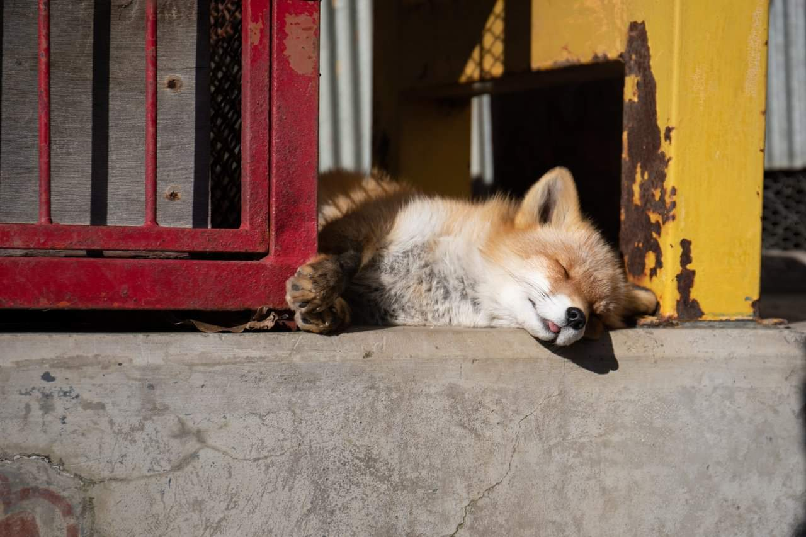
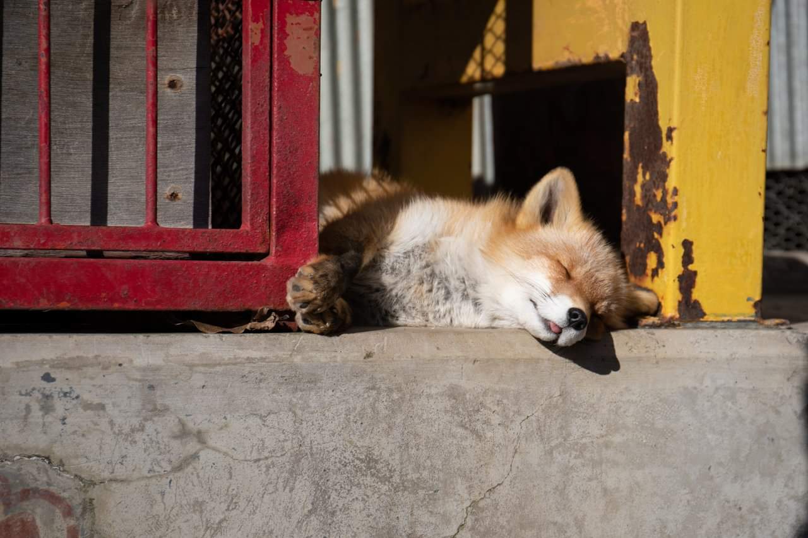
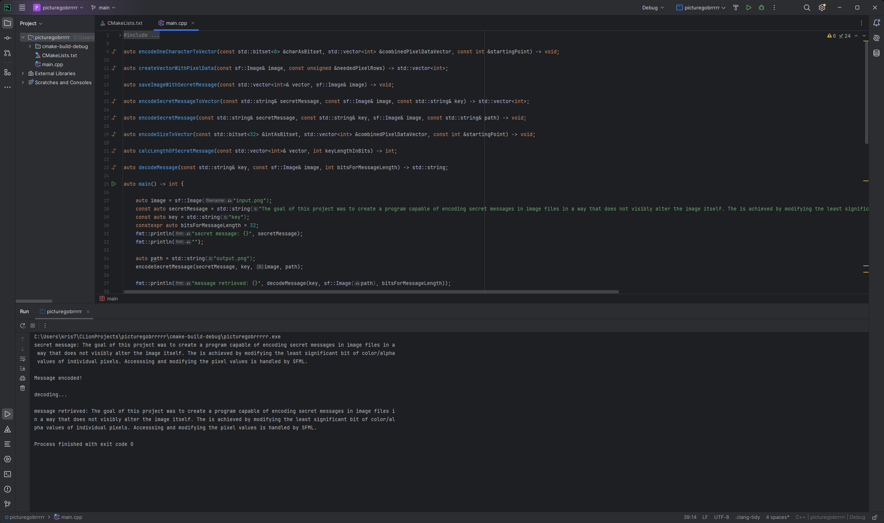

# ENCODING SECRET MESSAGES IN IMAGE FILES IN C++

## Overview
The goal of this project was to create a program capable of encoding secret messages in image files in a way that does not visibly alter the image itself. The is achieved by modifying the least significant bit of color/alpha values of individual pixels. Accesssing and modifying the pixel values is handled by [SFML](https://github.com/SFML/SFML "Simple and Fast Multimedia Library").

## Table of Contents
- [Detailed Description](#detailed-description)
- [Project Structure](#project-structure)
- [Features](#features)
- [Preview of The Application](#preview-of-the-application)
- [Technologies Used](#technologies-used)
- [Implementation Details](#implementation-details)
- [Future Work](#future-work)

## Detailed Description
The fundamental idea this project is based on is manipulating the least significant bit (LSB) to store information in color values of the pixels of image files. By modifying the LSB, a secret message can be encoded into the picture, while simultaneously altering the image itself in such a small way, it is virtually impossible to see with a naked eye. That way, as long as an unwated third party isn't aware the message had been encoded in the image file, there is no way for them to retrieve any information from the picture just by looking at it. Using this technique, this program is able to encode a secret text message and store it inside a picture. It is also possible to then retrieve the message by collecting the LSBs of the pixels and putting them together to recreate the input string. A limitation of this approach's implementation is that it only works for UTF-8 characters. The reason for that is because the way the program encodes text in the image files is by splitting every character's bit representation and replacing the LSB of the RGBA values of designated pixels with each bit derived from the singular UTF-8 character. Any UTF-8 character is represented by an 8-bit value - for example, the upppercase letter 'A' has a binary representation of '01000001'. That binary representation is then split into bits and the program overwrites the LSB of two designated pixels. Every character is encoded into exactly two pixels, because for every pixel the image holds for separate values - red, green, blue and alpha/opacity. While it may seem inefficient to leave seven out of eight bits for each color and opacity, a full HD picture with the dimensions 1920x1080 can hold over a million UTF characters using this method.   

The stages of the project were:
- importing the [SFML](https://github.com/SFML/SFML "Simple and Fast Multimedia Library") to handle modifying pixel values
- creating a function to copy color/alpha values of the pixels to a vector
- creating a function to turn a secret message string into a vector of bits
- modifying the pixels vector to encode a secret message onto it
- creating a function that inputs the modified vector back onto the image file
- creating a function to reverse the process and decode the message from an existing image 

## Project Structure
The file ```main.cpp``` contains the entirety of code written to handle encoding and decoding. ```cmake-build-debug/``` directory contains imported libraries as well as ```cmake-build-debug/input.png``` and ```cmake-build-debug/output.png``` that serve as the input image file and the image file with the already encoded secret message respectively. 

## Features
- encoding text messages in image files - supported formats are ```.png``` and ```.bmp```
- decoding messages from image files where a message had already been encoded
- saving image files with the encoded message to a relative path ```cmake-build-debug/```

### Preview of The Application

Input image             |  Image with the encoded message
:-------------------------:|:-------------------------:
  |  

Example of a message being encoded and decoded to/from an image. 
\


## Technologies Used
- [SFML](https://github.com/SFML/SFML "Simple and Fast Multimedia Library")
- [fmt](https://fmt.dev) - for handling writing strings and vectors to console
- [CMake](https://cmake.org/)

## Implementation Details
By modifying the LSB, a secret message can be encoded into the picture, while simultaneously altering the image itself in such a small way, it is virtually impossible to see with a naked eye. That way, as long as an unwated third party isn't aware the message had been encoded in the image file, there is no way for them to retrieve any information from the picture just by looking at it. Using this technique, this program is able to encode a secret text message and store it inside a picture. It is also possible to then retrieve the message by collecting the LSBs of the pixels and putting them together to recreate the input string. A limitation of this approach's implementation is that it only works for UTF-8 characters. The reason for that is because the way the program encodes text in the image files is by splitting every character's bit representation and replacing the LSB of the RGBA values of designated pixels with each bit derived from the singular UTF-8 character. Any UTF-8 character is represented by an 8-bit value - for example, the upppercase letter 'A' has a binary representation of '01000001'. That binary representation is then split into bits and the program overwrites the LSB of two designated pixels. Every character is encoded into exactly two pixels, because for every pixel the image holds for separate values - red, green, blue and alpha/opacity. While it may seem inefficient to leave seven out of eight bits for each color and opacity, a full HD picture with the dimensions 1920x1080 can hold over a million UTF characters using this method. Any lossy format (such as JPEG) cannot be used as the input image as these formats lose information when compressing files, thus overwriting carefully adjusted RGBA values. 

With every message a key is encoded that is required to be passed as an argument when trying to decode the message. This serves as a rudimentary security measure - if a 3rd party tries to decode our message, they need to know the key that was used to use the decoding function.

Lastly, after the key is encoded, the length of the secret message is also encoded in the picture so that the decoding algorith can know how many pixels it needs to read to get the full message back.

## Future Work
There are a few QoL upgrades that could be implemented to enhance the user experience. The obvious next step would be to allow the user to pass image paths as an argument so that any image can be used as the input file. Additionally, allowing for the use of text files as a source of the secret message could more easily enable the user to input longer text. Finally, the special key that is encoded alongside the message could be used for a bitwise opteration that further modifies the bits of the secret message, allowing for the message to be harder to decode even if the 3rd party knows how the program works, so long as they do not have the key itself.
